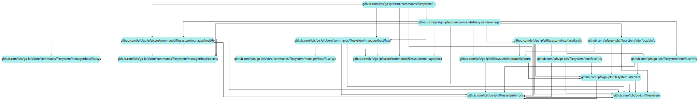

# File System

- [Overview](#overview)
- [Building](#building)
  * [Without a C compiler](#without-a-c-compiler)
  * [With a C compiler](#with-a-c-compiler)
  * [Running](#running)
- [Important interfaces](#important-interfaces)
  * [Command line](#command-line)
  * [File System Interface](#file-system-interface)
  * [IPFS cmds](#ipfs-cmds)
  * [Node Manager](#node-manager)
  * [Host instances](#host-instances)
- [Implementation details](#implementation-details)
  * [(FUSE/9P) API mappings themselves](#-fuse-9p--api-mappings-themselves)
  * [File System Directory interface](#file-system-directory-interface)
  * [Cross boundary locking (incomplete)](#cross-boundary-locking--incomplete-)
- [Misc Notes](#misc-notes)
  * [FUSE](#fuse)
  * [NetBSD](#netbsd)
  * [OpenBSD](#openbsd)

## Overview

Editors note:  
Nothing is final and this document is temporary.
It may be replaced with some user documentation around the command line interface if the help text can't be written succinctly enough.

The "filesystem" packages contain maps between the various IPFS APIs and a common file system interface.

The "core/commands/filesystem" packages provide a means to parse and dispatch requests, as well as manage instances of file system bindings.




## Building

The FUSE portions require [the dependencies of cgofuse](https://github.com/billziss-gh/cgofuse#how-to-build)  
(At the moment there's no build constraint in place to disable building the fuse components, but this will come later, allowing you to specify a build tag that disables FUSE, 9P, and/or other file system providers)

### Without a C compiler

On Windows, cgofuse can be built without a C compiler by disabling cgo when building `ipfs`.  
(CMD: `SET CGO_ENABLED=0`,  PowerShell: `$ENV:CGO_ENABLED=0`)  

### With a C compiler

To build with CGO enabled (recommended since other unrelated libraries may benefit from having access to a C compiler), you must have [WinFSP](http://www.secfs.net/winfsp/) installed, with its "Developer" feature included.

When building with CGO, if you encounter an error like this:

```text
pkg\mod\github.com\billziss-gh\cgofuse@v1.2.0\fuse\fsop_cgo.go:19:2: error: #error platform not supported
   19 | #error platform not supported
      |  ^~~~~
```

it means you're using an unsupported compiler.  
MinGW versions of `gcc` are supported. I personally use the MSYS2 project's `mingw64/mingw-w64-x86_64-gcc` with no issues.  
It should be noted that Cygwin versions of `gcc` may be supported, but will not be covered in this section (In the case of MSYS2, that would be package `msys/gcc`).  
So be sure to use a Golang compatible, Win32 native, C compiler.
If/when support is added to Golang, bias towards platform native compilers if you have the choice. (msvc > clang > gcc)

In addition, the C compiler needs to be aware of the WinFSP library headers somehow. Otherwise you'll see an error like this:

```text
pkg\mod\github.com\billziss-gh\cgofuse@v1.2.0\fuse\host_cgo.go:103:10: fatal error: fuse_common.h: No such file or directory
  103 | #include <fuse_common.h>
      |          ^~~~~~~~~~~~~~~
compilation terminated.
```

The easiest way to make the compiler aware of these files is put them into the `CPATH` environment variable before before building `ipfs`.  
By default they're in `"%ProgramFiles(x86)%\WinFsp\inc\fuse"`, so you may set the CPATH environment variable to include that path in its search.
(CMD: `SET CPATH=%CPATH%;%ProgramFiles(x86)%\WinFsp\inc\fuse`, PowerShell: `$ENV:CPATH += ";${ENV:ProgramFiles(x86)}\Winfspinc\fuse"`  
As stated above, Cygwin equivalents may work, but have not been tested and are not being covered by this document. Feel free to add information here if you try using WinFSP's Cygwin compatibility.

### Running

Regardless of how `ipfs` is built, the WinFSP system service is required for the resulting binary to speak with the kernel. This is included in the "Core" feature of the MSI package, and should remain installed on systems you wish to utilize mount features on. Otherwise commands that invoke mount functions will return an error asking you to install it. (you do not have to restart the node after installing, just re-run the command)

## Important interfaces

### Command line

The command line sub-commands `ipfs daemon` and `ipfs mount` and parsers for their parameters live in `./mount/cmds`.  
Values are populated (in priority order) from the parameters of the sub-command, the node's config file, or fall back to a platform suggested dynamic default. Feeding them into the underlying go interfaces.  

Issuing `ipfs mount` will mount a set of targets based on the above, but may be customized using combinations of parameters. A complex example would be `ipfs mount --provider=Plan9Protocol --namespace="IPFS,IPNS,FilesAPI" --target="/ipfs,/ipns,/file"` which mimic's the current defaults on Linux (when 9P is loaded in the kernel), more explicitly.  

Anything that can be determined by the implementation may be omitted.  Such as the provider, or the targets if they're within your config file.  
e.g. `ipfs mount --namespace="IPFS"` is valid and would expand to `ipfs mount --provider=Plan9Protocol --namespace="IPFS" --target="$(ipfs config Mounts.IPFS)"`  
Assume you unload 9P support from the kernel and make the same call, `ipfs mount --namespace="IPFS"` would now expand to `ipfs mount --provider=FUSE --namespace="IPFS" --target="$(ipfs config Mounts.IPFS)"` automatically.

It is also possible to specify any combination of namespaces and targets so long as the argument count matches.  
For example, this is a valid way to map IPFS to 2 different mountpoints `ipfs mount --namespace="IPFS,IPFS" -target="/ipfs,/mnt/ipfs"`  

At any time, you may list the currently active mounts via `ipfs mount --list` or shorthand `ipfs mount -l`
(NOTE: this works but it's not pretty printed yet)

`ipfs unmount` shares the same parameters as `ipfs mount` with the addition of a `-a` to unmount all previously mounted targets

`ipfs daemon` shares the same parameters as `ipfs mount` simply prefixed with `--mount-`.  
e.g. `ipfs daemon --mount --mount-provider="FUSE" --mount-namespace="IPFS,IPNS" --mount-target="/ipfs,/ipns"`  
It carries the same auto expansion rules, picking up missing parameters through the same deduction methods. (checks arguments, then config, then environment)

\* A lot of things below this line are outdated  
they're going to be moved into the godoc packages and linked to instead  
and the command line description via the helptext  
(later)

### File System Interface

(temporary godoc host)

[filesystem - Go Documentation Server](http://fiveeyes.iiiii.info:6060/pkg/github.com/ipfs/go-ipfs/filesystem/#Interface)

The well named `Interface` acts as a common interface between various APIs for use with our provider implementations. Allowing things to present themselves as a file system.  

Currently, we maintain a list of ID's for implementations to use, such as IPFS, IPNS, et al. (see godoc for full list)

### IPFS cmds

[fscmds - Go Documentation Server](http://fiveeyes.iiiii.info:6060/pkg/github.com/ipfs/go-ipfs/core/commands/filesystem/#pkg-subdirectories)

Responsible for defining `cmds.Command`s such as `mount`, `unmount`,  their parameters, their request parsers, \*translations methods for requests, etc.

(\*e.g `daemon --mount -...` -> `mount -...`)

### Node Manager

[manager - Go Documentation Server](http://fiveeyes.iiiii.info:6060/pkg/github.com/ipfs/go-ipfs/core/commands/filesystem/manager/)

Defines and implements a `Dispatcher`, which is responsible for taking in a list of requests, and returning a stream of their results. Dispatching them to their `Header{Host-API-ID:FS-ID}` pair's implementation method.

(e.g. internally one could map `dispatcher.Attach({fuse:IPFS}{/mnt/ipfs}, {fuse:IPFS}{/mnt/ipfs2}, ...)` to `dispatch(fuse, ipfs).mount("/mnt/ipfs", "/mnt/ipfs2", ...)` and plex these requests/results)

### Host instances

Host implementations for the managers API list, provide interfaces to make requests and communicate with the host system.

They return types of their own, such as `fuse`'s  [mounter](http://j.desk.top:6060/pkg/github.com/ipfs/go-ipfs/core/commands/filesystem/manager/host/fuse/#Mounter), or `p9fsp``s [attacher](http://fiveeyes.iiiii.info:6060/pkg/github.com/ipfs/go-ipfs/core/commands/filesystem/manager/host/9p/#Attacher).

Which take in their own specific requests, but reply with a common message format (a [host.Response](http://fiveeyes.iiiii.info:6060/pkg/github.com/ipfs/go-ipfs/core/commands/filesystem/manager/host/#Response)), which contain a [host.Binding](http://fiveeyes.iiiii.info:6060/pkg/github.com/ipfs/go-ipfs/core/commands/filesystem/manager/host/#Binding), the result of binding the deconstructor returned from the host, with a symbolic representation (the request that caused its construction).

(conceptually: `host.Binding{"/n/ipfs":io.Closer}`)

## Implementation details

### (FUSE/9P) API mappings themselves

API mappings utilize the file system `Interface` and simply transform data from it into external API specific constructs. For example this is the `Gettattr` for IPFS under FUSE.

```go
    ...
    iStat, _, err := fs.intf.Info(path, filesystem.StatRequestAll)
        if err != nil {
            errNo := interpretError(err)
            if errNo != -fuselib.ENOENT { // don't flood the logs with "not found" errors
                fs.log.Error(err)
            }
            return errNo
        }

        var ids statIDGroup
        ids.uid, ids.gid, _ = fuselib.Getcontext()
        applyIntermediateStat(stat, iStat)
        applyCommonsToStat(stat, fs.filesWritable, fs.mountTimeGroup, ids)
        return operationSuccess
```

and under 9P

```go
    ...

    fidInfo, infoFilled, err := f.intf.Info(f.path.String(), requestFrom9P(req))
    if err != nil {
        return f.QID, ninelib.AttrMask{}, ninelib.Attr{}, interpretError(err)
    }

    attr := attrFromCore(fidInfo) // TODO: maybe resolve IDs
    tg := timeGroup{atime: f.initTime, mtime: f.initTime, ctime: f.initTime, btime: f.initTime}
    applyCommonsToAttr(&attr, f.filesWritable, tg, idGroup{uid: ninelib.NoUID, gid: ninelib.NoGID})

    return f.QID, filledFromCore(infoFilled), attr, nil
```

A version of the `pinfs` (a directory which lists the node's pins as files and directories) has been implemented using this method. ~~Its use within FUSE looks like this:~~  
This is how it was, but it's in the process of being changed for standards compliance.

### File System Directory interface

[filesystem.Directory - Go Documentation Server](http://fiveeyes.iiiii.info:6060/pkg/github.com/ipfs/go-ipfs/filesystem/#Directory)

This is (for the moment) our semantics for what a directory is. It may need to change, or be redefined. But currently returns a stream of entries, containing an offset and an error value if one was encountered during operation.

This is an example usage of translating these entries from `filesystem.DirectoryEntry` to FUSE native entries.

```go
package fuse

func OpenDir() {
    directory, err := fs.intf.OpenDirectory(path)
...
}

func Readdir() {
    callCtx, cancel := context.WithCancel(ctx)
    defer cancel()

    errNo, err := fillDir(callCtx, directory, fill, ofst)
    if err != nil {
        fs.log.Error(err)
    }

    return errNo
}

func fillDir(ctx context.Context, directory filesystem.irectory, fill fuseFillFunc, offset int64) (int, error) {
...
    if offset == 0 {
        if err := directory.Reset(); err != nil {
            // NOTE: POSIX `rewinddir` is not expected to fail
            // if this happens, we'll inform FUSE's `readdir` that the stream position is (now) invalid
            return -fuselib.ENOENT, err // see: SUSv7 `readdir` "Errors"
        }
    }

    readCtx, cancel := context.WithCancel(ctx)
    defer cancel()

    for ent := range directory.List(readCtx, uint64(offset)) {
        if err := ent.Error(); err != nil {
            return -fuselib.ENOENT, err
        }
        stat = statFunc(ent.Name())
        if !fill(ent.Name(), stat, int64(ent.Offset())) {
            cancel()
        }
    }

    return operationSuccess, nil
}
```

### Cross boundary locking (incomplete)

In order to allow the daemon to perform normal operations without locking the user out of certain features, such as publishing to IPNS keys or using the FilesAPI via the `ipfs` command, or other API instances. We'll want to incorporate a shared resource lock on the daemon for these namespaces to use.
For example, within the `ipfs name publish` command we would like to acquire a lock for the key we are about to publish to, which may or may not also be in use by an `ipfs mount` instance, or other instance of the CoreAPI.
Likewise with `ipfs files` in general.
As a result we'll need some kind of interface such as this

```go
type ResourceLock interface {
    Request(namespace mountinter.Namespace, resourceReference string, ltype LockType, timeout time.Duration) error
    Release(namespace mountinter.Namespace, resourceReference string, ltype LockType)
}
```

usable within the `name publish` cmd as

```go
err := daemonNode.???.Request(mountinter.NamespaceIPNS, "/${key-hash}", mountinter.LockDataWrite, 0)
```

where the same instance is used by the rest of the services on the daemon, such as `files`, and `mount`.
Any may hold the lock at various points, preventing one another from colliding and creating inconsistency without entirely disabling functionality on the node / holding exclusive access of the entire node.

NOTE: a quick hack was written to implement this but I don't trust myself to implement it correctly/efficiently.  
This will require research to see how other systems perform ancestry style path locking and which libraries already exist that could help with it.

## Misc Notes

___

### FUSE

It should be noted somewhere, the behaviour of (Go)`fuse.Getcontext`/(C)`fuse_get_context`.  
None of the implementations have useful documentation for this call, other than saying the pointer to the structure should not be held past the operation call that invoked it.  
The various implementations have varying results. For example, consider the non-exhaustive table below.  

| FreeBSD (fusefs)<br>NetBSD (PUFFS)<br>macOS (FUSE for macOS) | Linux (fuse)       | Windows (WinFSP)   |
| ------------------------------------------------------------ | ------------------ | ------------------ |
| opendir: populated                                           | opendir: populated | opendir: populated |
| readdir: populated                                           | readdir: populated | readdir: NULL      |
| releasedir: populated                                        | releasedir: NULL   | releasedir: NULL   |

Inherently, but not via any spec, the context is only required to be populated within operations that create system files and/or check system access. (Without them, you wouldn't be able to implement file systems that adhere to POSIX specifications.)  
i.e. `opendir` must know the UID/GID of the caller in order to check access permissions, but `readdir` does not, since `readdir` implies that the check was already done in `opendir` (as it must receive a valid reference that was previously returned from `opendir`).  

As such, for our `readdir` implementations, we obtain the context during `opendir`, and bind it with the associated handle construct, if it's needed.  
During normal operation it's not, but for systems that supporting FUSE's "readdirplus" capability, we need the context of the caller who opened the directory at the time of `readdir` operation.

### NetBSD

is only allowing 1 mountpoint to be active at a time, if a second mountpoint is requested, it will be mapped, but the previous mountpoint will be overtaken by the new one.  
e.g. consider the sequence:  
`ipfs mount --namespace=pinfs --target=/ipfs` will mount the pinfs to `/ipfs`  
`ipfs mount --namespace=keyfs --target=/ipns` will mount the keyfs to `/ipns`  
at this moment, listing either `/ipfs` or `/ipns` will return results from the keyfs.  
This is likely a cgofuse bug, needs looking into.  
Otherwise, things seem to work as expected.  
(Env: NetBSD 9.0, Go 1.14.2)  
TODO: NetBSD has support for mounting via 9P2000 and 9p2000.u (but not .L)  
look into adding support for either in the p9 library we use (would add support for a bunch more platforms and tools than NetBSD as well)

### OpenBSD

is allowing traversal and `cat`ing of files, but `getdents` is failing in `ls`.

```text
 57206 ls       CALL  fstat(4,0x7f7ffffd9fe8)
 57206 ls       STRU  struct stat { dev=9733, ino=1, mode=dr-xr-xr-- , nlink=0, uid=0<"root">, gid=0<"wheel">, rdev=0, atime=0, mtime=0, ctime=0, size=0, blocks=4, blksize=512, flags=0x0, gen=0x0 }
 57206 ls       RET   fstat 0
 57206 ls       CALL  fchdir(4)
 57206 ls       RET   fchdir 0
 57206 ls       CALL  getdents(4,0x95a668ff000,0x1000)
 57206 ls       RET   getdents -1 errno 2 No such file or directory
 57206 ls       CALL  close(4)
 57206 ls       RET   close 0
```

The daemon is receiving a very large offset/`seekdir` value for some reason.

```text
2020-05-07T05:32:11.856-0400    DEBUG   fuse/pinfs      pinfs/pinfs.go:90       Getattr - {FFFFFFFFFFFFFFFF}"/"
2020-05-07T05:32:11.856-0400    DEBUG   fuse/pinfs      pinfs/pinfs.go:90       Getattr - {FFFFFFFFFFFFFFFF}"/"
2020-05-07T05:32:11.856-0400    DEBUG   fuse/pinfs      pinfs/pinfs.go:113      Opendir - "/"
2020-05-07T05:32:11.856-0400    DEBUG   fuse/pinfs      pinfs/pinfs.go:90       Getattr - {FFFFFFFFFFFFFFFF}"/"
2020-05-07T05:32:11.856-0400    DEBUG   fuse/pinfs      pinfs/pinfs.go:157      Readdir - {1|0}"/"
2020-05-07T05:32:11.856-0400    DEBUG   fuse/pinfs      pinfs/pinfs.go:157      Readdir - {1|208}"/"
2020-05-07T05:32:11.856-0400    ERROR   fuse/pinfs      pinfs/pinfs.go:171      offset 206 is not/no-longer valid
2020-05-07T05:32:11.857-0400    DEBUG   fuse/pinfs      pinfs/pinfs.go:139      Releasedir - {1}"/"
2020-05-07T05:32:11.857-0400    DEBUG   fuse/pinfs      pinfs/pinfs.go:90       Getattr - {FFFFFFFFFFFFFFFF}"/"
2020-05-07T05:32:11.857-0400    DEBUG   fuse/pinfs      pinfs/pinfs.go:113      Opendir - "/"
2020-05-07T05:32:11.857-0400    DEBUG   fuse/pinfs      pinfs/pinfs.go:90       Getattr - {FFFFFFFFFFFFFFFF}"/"
2020-05-07T05:32:11.857-0400    DEBUG   fuse/pinfs      pinfs/pinfs.go:90       Getattr - {FFFFFFFFFFFFFFFF}"/"
2020-05-07T05:32:11.857-0400    DEBUG   fuse/pinfs      pinfs/pinfs.go:90       Getattr - {FFFFFFFFFFFFFFFF}"/"
2020-05-07T05:32:11.857-0400    DEBUG   fuse/pinfs      pinfs/pinfs.go:157      Readdir - {2|0}"/"
2020-05-07T05:32:11.857-0400    DEBUG   fuse/pinfs      pinfs/pinfs.go:157      Readdir - {2|208}"/"
2020-05-07T05:32:11.857-0400    ERROR   fuse/pinfs      pinfs/pinfs.go:171      offset 206 is not/no-longer valid
2020-05-07T05:32:11.857-0400    DEBUG   fuse/pinfs      pinfs/pinfs.go:139      Releasedir - {2}"/"
```

Readdir tests are passing within Go on the platform, so this is likely a cgofuse issue.  
This is also the only platform currently where `ls` doesn't work.  
Needs investigating.  
(Env: OpenBSD 6.6, Go 1.13.1; OpenBSD 6.7, Go 1.14.4; (b23023597) OpenBSD 6.7, Go 1.14.6)

I wonder if this is something thread related. I tried locking the goroutine that calls `Mount` to the OS thread, but it didn't seem to influence anything. I need to see if I can break the cgofuse memfs examples on OpenBSD by mounting it via goroutine.
