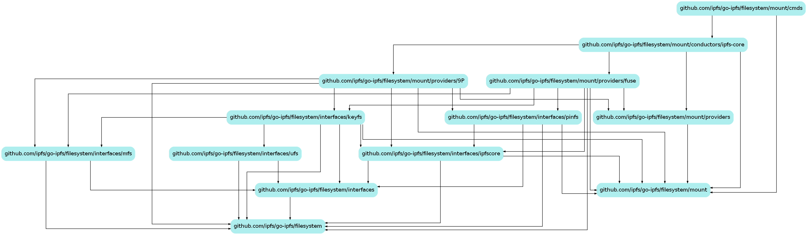

# File System

* [Overview](#overview)
* [Building](#building)
* [Important interfaces](#important-interfaces)
  * [Command line](#command-line)
  * [Conductors](#conductors)
  * [Providers](#providers)
  * [Instances](#provider-instances)
* [Implementation details](#implementation-details-incomplete)
  * [Cross boundary locking](#cross-boundary-locking)
  * [File system implementations](#file-system-implementations-themselves)

## Overview

Editors note:  
Nothing here is final and this document is going to go away when things are.  
It may be replaced with some user documentation around the command line interface if the help text can't be written succinctly enough.


The "filesystem" directory contains mappings between the various IPFS APIs and ways to facilitate mounting them on various hosts using various APIs.  

```text
filesystem
├── interfaces (a common file system interface)
│   ├── ipfscore (mappings of the IPFS api's to this common interface)
│   ├── keyfs
│   ├── mfs
│   ├── pinfs
│   └── ufs
└── mount
    ├── cmds (hosts ipfs-cmds lib parameters and sub-commands for `daemon`, `mount`, and `unmount`)
    ├── conductors (*this might change places/name; interfaces that manage requests for new and existing mount instances)
    │   └── ipfs-core (this might be rolled up into a single "conductor" package)
    └── providers (Providers provide mappings between the common file system API above and their own API)
        ├── 9P
        └── fuse
```


Primarily, the packages are used to construct a "mount conductor" (it's like a volume manager) and bind it to the IPFS daemon/node instance. *TODO: define these properly and use real English  

The conductor will facilitate management of file system "providers" (they're like volume constructors).  

"Providers" provide implementations of file systems, and facilities to graft them to some target.  
Typically this will be mounting file systems to a path in the host system.  
(e.g. mounting the abstract namespace "IPFS" to the local path `/ipfs`  via the FUSE API)

## Building

The FUSE portions require [the dependencies of cgofuse](https://github.com/billziss-gh/cgofuse#how-to-build)  
(At the moment there's no build constraint in place to disable building the fuse components, but this will come later, allowing you to specify a build tag that disables FUSE, 9P, and/or other file system providers)

### Without a C compiler

On Windows, cgofuse can be built without a C compiler by disabling cgo when building `ipfs`.  
(CMD: `SET CGO_ENABLED=0`,  PowerShell: `$ENV:CGO_ENABLED=0`)  

### With a C compiler

To build with CGO enabled (recommended since other unrelated libraries may benefit from having access to a C compiler), you must have [WinFSP](http://www.secfs.net/winfsp/) installed, with its "Developer" feature included.

When building with CGO, if you encounter an error like this:

```text
pkg\mod\github.com\billziss-gh\cgofuse@v1.2.0\fuse\fsop_cgo.go:19:2: error: #error platform not supported
   19 | #error platform not supported
      |  ^~~~~
```

it means you're using an unsupported compiler.  
MinGW versions of `gcc` are supported. I personally use the MSYS2 project's `mingw64/mingw-w64-x86_64-gcc` with no issues.  
It should be noted that Cygwin versions of `gcc` may be supported, but will not be covered in this section (In the case of MSYS2, that would be package `msys/gcc`).  
So be sure to use a Golang compatible, Win32 native, C compiler.
If/when support is added to Golang, bias towards platform native compilers if you have the choice. (msvc > clang > gcc)

In addition, the C compiler needs to be aware of the WinFSP library headers somehow. Otherwise you'll see an error like this:

```text
pkg\mod\github.com\billziss-gh\cgofuse@v1.2.0\fuse\host_cgo.go:103:10: fatal error: fuse_common.h: No such file or directory
  103 | #include <fuse_common.h>
      |          ^~~~~~~~~~~~~~~
compilation terminated.
```

The easiest way to make the compiler aware of these files is put them into the `CPATH` environment variable before before building `ipfs`.  
By default they're in `"%ProgramFiles(x86)%\WinFsp\inc\fuse"`, so you may set the CPATH environment variable to include that path in its search.
(CMD: `SET CPATH=%CPATH%;%ProgramFiles(x86)%\WinFsp\inc\fuse`, PowerShell: `$ENV:CPATH += ";${ENV:ProgramFiles(x86)}\Winfsp\inc\fuse"`  
As stated above, Cygwin equivalents may work, but have not been tested and are not being covered by this document. Feel free to add information here if you try using WinFSP's Cygwin compatibility.

### Running

Regardless of how `ipfs` is built, the WinFSP system service is required for the resulting binary to speak with the kernel. This is included in the "Core" feature of the MSI package, and should remain installed on systems you wish to utilize mount features on. Otherwise commands that invoke mount functions will return an error asking you to install it. (you do not have to restart the node after installing, just re-run the command)

## Important interfaces

### Command line

The command line sub-commands `ipfs daemon` and `ipfs mount` and parsers for their parameters live in `./mount/cmds`.  
Values are populated (in priority order) from the parameters of the sub-command, the node's config file, or fall back to a platform suggested dynamic default. Feeding them into the underlying go interfaces.  

Issuing `ipfs mount` will mount a set of targets based on the above, but may be customized using combinations of parameters. A complex example would be `ipfs mount --provider=Plan9Protocol --namespace="IPFS,IPNS,FilesAPI" --target="/ipfs,/ipns,/file"` which mimic's the current defaults on Linux (when 9P is loaded in the kernel), more explicitly.  

Anything that can be determined by the implementation may be omitted.  Such as the provider, or the targets if they're within your config file.  
e.g. `ipfs mount --namespace="IPFS"` is valid and would expand to `ipfs mount --provider=Plan9Protocol --namespace="IPFS" --target="$(ipfs config Mounts.IPFS)"`  
Assume you unload 9P support from the kernel and make the same call, `ipfs mount --namespace="IPFS"` would now expand to `ipfs mount --provider=FUSE --namespace="IPFS" --target="$(ipfs config Mounts.IPFS)"` automatically.

It is also possible to specify any combination of namespaces and targets so long as the argument count matches.  
For example, this is a valid way to map IPFS to 2 different mountpoints `ipfs mount --namespace="IPFS,IPFS" -target="/ipfs,/mnt/ipfs"`  

At any time, you may list the currently active mounts via `ipfs mount --list` or shorthand `ipfs mount -l`
(NOTE: this works but it's not pretty printed yet)

`ipfs unmount` shares the same parameters as `ipfs mount` with the addition of a `-a` to unmount all previously mounted targets

`ipfs daemon` shares the same parameters as `ipfs mount` simply prefixed with `--mount-`.  
e.g. `ipfs daemon --mount --mount-provider="FUSE" --mount-namespace="IPFS,IPNS" --mount-target="/ipfs,/ipns"`  
It carries the same auto expansion rules, picking up missing parameters through the same deduction methods. (checks arguments, then config, then environment)

### File System Interface

The well named `Interface` acts as a common interface between various APIs for use with our provider implementations. Allowing things to present themselves as a file system.  
*The name and structure of this is likely to change

```go
type Interface interface {
	// index
	Open(path string, flags IOFlags) (File, error)
	OpenDirectory(path string) (Directory, error)
	Info(path string, req StatRequest) (*Stat, StatRequest, error)
	ExtractLink(path string) (string, error)

	// creation
	Make(path string) error
	MakeDirectory(path string) error
	MakeLink(path, target string) error

	// removal
	Remove(path string) error
	RemoveDirectory(path string) error
	RemoveLink(path string) error

	// modification
	Rename(oldName, newName string) error

	// system
	Close() error // TODO: I don't know if it's a good idea to have this; an even though it's Go convention the name is kind of bad for this
	// TODO: consider
	// Subsystem(path string) (Root, error)
	// e.g. keyfs.Subsystem("/Qm.../an/ipns/path") => (ipns.Root, nil)
}

```

### Conductors

(Note: I don't like this name but couldn't think of anything better; something like volume manager wouldn't be bad)  
The Conductor is responsible for managing multiple "system `Provider`s". Delegating requests to them, while also managing the instances they provide.

```go
type Conductor interface {
	// Graft uses the selected provider to map groups of namespaces to their targets
	Graft(ProviderType, []TargetCollection) error
	// Detach removes a previously grafted target
	Detach(target string) error
	// Where provides the mapping of providers and their targets
	Where() map[ProviderType][]string
}
```

An implementation of this exists in `mount/conductors/ipfs-core` which is constructed by the daemon on startup or upon calling the mount sub-command. It's stored on the node and shared across calls. It utilizes the IPFS core API for it's operations.

```go
node.Mount = mountcon.NewConductor(node.Context(), coreAPI, opts...)
```

### Providers

Providers provide instances of a namespace/file system and a means with which to bind it to some target (like a path in the operating system's own file system).

```go
// Provider interacts with a namespace and the file system
// grafting a file system implementation to a target
type Provider interface {
	// grafts the target to the file system, returning the interface to detach it
	Graft(target string) (Instance, error)
	// returns true if the target has been grafted but not detached
	Grafted(target string) bool
	// returns a list of grafted targets
	Where() []string
}
```

There are currently 2 providers, 1 for the Plan 9 protocol and 1 for FUSE. They live under `./mount/providers`.  
The providers themselves map the file system `Interface` to their respective API  

Our conductor manages multiple providers on demand. Here is an example of instantiating a 9P related request

```go
mount9p.NewProvider(ctx, namespace, listenAddr, coreAPI, ops...)
mountfuse.NewProvider(ctx, namespace, fuseArgs, coreAPI, ops...)
```

### Provider instances

Simply, provider instances are instances generated by the provider that should be tracked by the caller that generated them. In our case this is the conductor which maps a series of targets to instances, allowing callers to detach these instances by name/path. Following the traditional model of volumes, you can think of these almost as active partitions of a volume.

```go
// Instance is an active provider target that may be detached from the file system
type Instance interface {
	Detach() error
	Where() (string, error)
}
```

```go
instance, err := someProvider.Graft(target)
```

## Implementation details (incomplete)

### Cross boundary locking

In order to allow the daemon to perform normal operations without locking the user out of certain features, such as publishing to IPNS keys or using the FilesAPI via the `ipfs` command, or other API instances. We'll want to incorporate a shared resource lock on the daemon for these namespaces to use.
For example, within the `ipfs name publish` command we would like to acquire a lock for the key we are about to publish to, which may or may not also be in use by an `ipfs mount` instance, or other instance of the CoreAPI.
Likewise with `ipfs files` in general.
As a result we'll need some kind of interface such as this

```go
type ResourceLock interface {
	Request(namespace mountinter.Namespace, resourceReference string, ltype LockType, timeout time.Duration) error
	Release(namespace mountinter.Namespace, resourceReference string, ltype LockType)
}
```

usable within the `name publish` cmd as

```go
err := daemonNode.???.Request(mountinter.NamespaceIPNS, "/${key-hash}", mountinter.LockDataWrite, 0)
```

where the same instance is used by the rest of the services on the daemon, such as `files`, and `mount`.
Any may hold the lock at various points, preventing one another from colliding and creating inconsistency without entirely disabling functionality on the node / holding exclusive access of the entire node.  

NOTE: a quick hack was written to implement this but I don't trust myself to implement it correctly/efficiently.  
This will require research to see how other systems perform ancestry style path locking and which libraries already exist that could help with it.  

###  API mappings themselves

API mappings utilize the file system `Interface` and simply transform data from it into external API specific constructs. For example this is the `Gettattr` for IPFS under FUSE.

```go
	...
	iStat, _, err := fs.intf.Info(path, filesystem.StatRequestAll)
		if err != nil {
			errNo := interpretError(err)
			if errNo != -fuselib.ENOENT { // don't flood the logs with "not found" errors
				fs.log.Error(err)
			}
			return errNo
		}

		var ids statIDGroup
		ids.uid, ids.gid, _ = fuselib.Getcontext()
		applyIntermediateStat(stat, iStat)
		applyCommonsToStat(stat, fs.filesWritable, fs.mountTimeGroup, ids)
		return operationSuccess
```

and under 9P

```go
	...

	fidInfo, infoFilled, err := f.intf.Info(f.path.String(), requestFrom9P(req))
	if err != nil {
		return f.QID, ninelib.AttrMask{}, ninelib.Attr{}, interpretError(err)
	}

	attr := attrFromCore(fidInfo) // TODO: maybe resolve IDs
	tg := timeGroup{atime: f.initTime, mtime: f.initTime, ctime: f.initTime, btime: f.initTime}
	applyCommonsToAttr(&attr, f.filesWritable, tg, idGroup{uid: ninelib.NoUID, gid: ninelib.NoGID})

	return f.QID, filledFromCore(infoFilled), attr, nil

```

A version of the `pinfs` (a directory which lists the node's pins as files and directories) has been implemented using this method. ~~Its use within FUSE looks like this:~~  
This is how it was, but it's in the process of being changed for standards compliance.

## Directory interface

TODO: move this text out and just reference the godoc comment
(We should also talk about the implementation of streams somewhere, probably also in godoc)  

Directories return a channel of their entries, which contain a name and an offset.  
The initial call to List must have an offset value of 0.  
Subsequent calls to List with a non-0 offset shall replay the stream exactly, starting at the provided offset. (entries are returned in the same order with the same values)  
Calling Reset shall reset the stream as if it had just been opened.  
Previous offset values may be considered invalid after a Reset, but are not required to be.

translation of the entries into API specific constructs is to be done in the file system layer

```go
type DirectoryEntry interface {
	Name() string
	Offset() uint64
	Error() error
}

type Directory interface {
	// List attempts to return all entires starting from offset until it reaches the end
	// or the context is canceled
	// if an error is encountered, an entry is returned containing it, and the channel is closed
	List(ctx context.Context, offset uint64) <-chan DirectoryEntry
	Reset() error
	io.Closer
}
```

```go
// FUSE OpenDir(){
directory, err := fs.intf.OpenDirectory(path)
// FUSE Readdir{
readCtx, cancel := context.WithCancel(ctx)
	defer cancel()

	for ent := range directory.List(readCtx, uint64(offset)) {
		if err := ent.Error(); err != nil {
			return -fuselib.ENOENT, err
		}
		stat = statFunc(ent.Name())
		if !fill(ent.Name(), stat, int64(ent.Offset())) {
			break
		}
	}
```

## Misc Notes

___

### FUSE

It should be noted somewhere, the behaviour of (Go)`fuse.Getcontext`/(C)`fuse_get_context`.  
None of the implementations have useful documentation for this call, other than saying the pointer to the structure should not be held past the operation call that invoked it.  
The various implementations have varying results. For example, consider the non-exhaustive table below.  

|FreeBSD (fusefs)<br>NetBSD (PUFFS)<br>macOS (FUSE for macOS)   | Linux (fuse)       | Windows (WinFSP)   |
|------------------------------------------------------------   | ------------       | ----------------   |
| opendir: populated                                            | opendir: populated | opendir: populated |
| readdir: populated                                            | readdir: populated | readdir: NULL      |
| releasedir: populated                                         | releasedir: NULL   | releasedir: NULL   |

Inherently, but not via any spec, the context is only required to be populated within operations that create system files and/or check system access. (Without them, you wouldn't be able to implement file systems that adhear to POSIX specifications.)  
i.e. `opendir` must know the UID/GID of the caller in order to check access permissions, but `readdir` does not, since `readdir` implies that the check was already done in `opendir` (as it must receive a valid reference that was previously returned from `opendir`).  

As such, for our `readdir` implementations, we obtain the context during `opendir`, and bind it with the associated handle construct, if it's needed.  
During normal operation it's not, but for systems that supporting FUSE's "readdirplus" capability, we need the context of the caller who opened the directory at the time of `readdir` operation.

### NetBSD

is only allowing 1 mountpoint to be active at a time, if a second mountpoint is requested, it will be mapped, but the previous mountpoint will be overtaken by the new one.  
e.g. consider the sequence:  
`ipfs mount --namespace=pinfs --target=/ipfs` will mount the pinfs to `/ipfs`  
`ipfs mount --namespace=keyfs --target=/ipns` will mount the keyfs to `/ipns`  
at this moment, listing either `/ipfs` or `/ipns` will return results from the keyfs.  
This is likely a cgofuse bug, needs looking into.  
Otherwise, things seem to work as expected.  
(Env: NetBSD 9.0, Go 1.14.2)  
TODO: NetBSD has support for mounting via 9P2000 and 9p2000.u (but not .L)  
look into adding support for either in the p9 library we use (would add support for a bunch more platforms and tools than NetBSD as well)

### OpenBSD

is allowing traversal and `cat`ing of files, but `getdents` is failing in `ls`.

```text
 57206 ls       CALL  fstat(4,0x7f7ffffd9fe8)
 57206 ls       STRU  struct stat { dev=9733, ino=1, mode=dr-xr-xr-- , nlink=0, uid=0<"root">, gid=0<"wheel">, rdev=0, atime=0, mtime=0, ctime=0, size=0, blocks=4, blksize=512, flags=0x0, gen=0x0 }
 57206 ls       RET   fstat 0
 57206 ls       CALL  fchdir(4)
 57206 ls       RET   fchdir 0
 57206 ls       CALL  getdents(4,0x95a668ff000,0x1000)
 57206 ls       RET   getdents -1 errno 2 No such file or directory
 57206 ls       CALL  close(4)
 57206 ls       RET   close 0
```

The daemon is receiving a very large offset/`seekdir` value for some reason.

```text
2020-05-07T05:32:11.856-0400    DEBUG   fuse/pinfs      pinfs/pinfs.go:90       Getattr - {FFFFFFFFFFFFFFFF}"/"
2020-05-07T05:32:11.856-0400    DEBUG   fuse/pinfs      pinfs/pinfs.go:90       Getattr - {FFFFFFFFFFFFFFFF}"/"
2020-05-07T05:32:11.856-0400    DEBUG   fuse/pinfs      pinfs/pinfs.go:113      Opendir - "/"
2020-05-07T05:32:11.856-0400    DEBUG   fuse/pinfs      pinfs/pinfs.go:90       Getattr - {FFFFFFFFFFFFFFFF}"/"
2020-05-07T05:32:11.856-0400    DEBUG   fuse/pinfs      pinfs/pinfs.go:157      Readdir - {1|0}"/"
2020-05-07T05:32:11.856-0400    DEBUG   fuse/pinfs      pinfs/pinfs.go:157      Readdir - {1|208}"/"
2020-05-07T05:32:11.856-0400    ERROR   fuse/pinfs      pinfs/pinfs.go:171      offset 206 is not/no-longer valid
2020-05-07T05:32:11.857-0400    DEBUG   fuse/pinfs      pinfs/pinfs.go:139      Releasedir - {1}"/"
2020-05-07T05:32:11.857-0400    DEBUG   fuse/pinfs      pinfs/pinfs.go:90       Getattr - {FFFFFFFFFFFFFFFF}"/"
2020-05-07T05:32:11.857-0400    DEBUG   fuse/pinfs      pinfs/pinfs.go:113      Opendir - "/"
2020-05-07T05:32:11.857-0400    DEBUG   fuse/pinfs      pinfs/pinfs.go:90       Getattr - {FFFFFFFFFFFFFFFF}"/"
2020-05-07T05:32:11.857-0400    DEBUG   fuse/pinfs      pinfs/pinfs.go:90       Getattr - {FFFFFFFFFFFFFFFF}"/"
2020-05-07T05:32:11.857-0400    DEBUG   fuse/pinfs      pinfs/pinfs.go:90       Getattr - {FFFFFFFFFFFFFFFF}"/"
2020-05-07T05:32:11.857-0400    DEBUG   fuse/pinfs      pinfs/pinfs.go:157      Readdir - {2|0}"/"
2020-05-07T05:32:11.857-0400    DEBUG   fuse/pinfs      pinfs/pinfs.go:157      Readdir - {2|208}"/"
2020-05-07T05:32:11.857-0400    ERROR   fuse/pinfs      pinfs/pinfs.go:171      offset 206 is not/no-longer valid
2020-05-07T05:32:11.857-0400    DEBUG   fuse/pinfs      pinfs/pinfs.go:139      Releasedir - {2}"/"
```

Readdir tests are passing within Go on the platform, so this is likely a cgofuse issue.  
This is also the only platform currently where `ls` doesn't work.  
Needs investigating.  
(Env: OpenBSD 6.6, Go 1.13.1; OpenBSD 6.7, Go 1.14.4)
